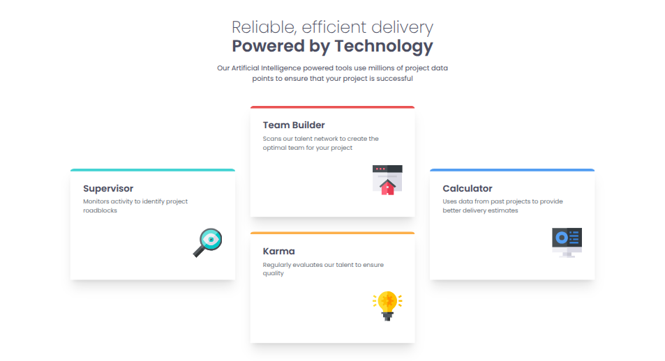
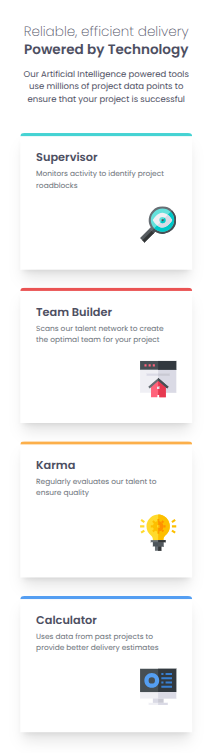

# Frontend Mentor - Four card feature section solution

This is a solution to the [Four card feature section challenge on Frontend Mentor](https://www.frontendmentor.io/challenges/four-card-feature-section-weK1eFYK). Frontend Mentor challenges help you improve your coding skills by building realistic projects. 

## Table of contents

- [Frontend Mentor - Four card feature section solution](#frontend-mentor---four-card-feature-section-solution)
  - [Table of contents](#table-of-contents)
  - [Overview](#overview)
    - [The challenge](#the-challenge)
    - [Screenshot](#screenshot)
    - [Links](#links)
  - [My process](#my-process)
    - [Built with](#built-with)
    - [What I learned](#what-i-learned)
    - [Continued development](#continued-development)
    - [Useful resources](#useful-resources)


## Overview

### The challenge

Users should be able to:

- View the optimal layout for the site depending on their device's screen size

### Screenshot




### Links

- Solution URL: [Github](https://github.com/adamskiee-frontendmentor-projects/four-card-feature)
- Live Site URL: [Website](https://adamskiee-frontendmentor-projects.github.io/four-card-feature/)

## My process

### Built with

- Semantic HTML5 markup
- CSS custom properties
- Flexbox
- CSS Grid
- Mobile-first workflow
- [Tailwind](https://tailwindcss.com/) - CSS Framework

### What I learned

1. Customizing grid items
```html
<div class="card border-t-orange min-desktop:order-2">
 <h2>Karma</h2>
 <p>Regularly evaluates our talent to ensure quality</p>
 
</div>
<div class="card border-t-blue row-span-2">
 <h2>Calculator</h2>
 <p>
   Uses data from past projects to provide better delivery estimates
 </p>
 
</div>
```

2. DRY Principle
```css
.card {
    @apply flex flex-col gap-1 px-7 py-6 rounded-t-[2.5%] border-t-[0.369rem] shadow-xl h-auto my-auto;
}
.card > h2 {
    @apply font-semibold text-xl;
}
.card > p {
    @apply text-[0.822rem] text-grey-400;
}
.card > img {
    @apply self-end my-6 size-16;
}
```

### Continued development
- I want to learn more about minimizing the slow performance of the website cause by the frontend.

### Useful resources

- [nekocalc](https://nekocalc.com/px-to-rem-converter) - This helped to translate pixel to rem.
